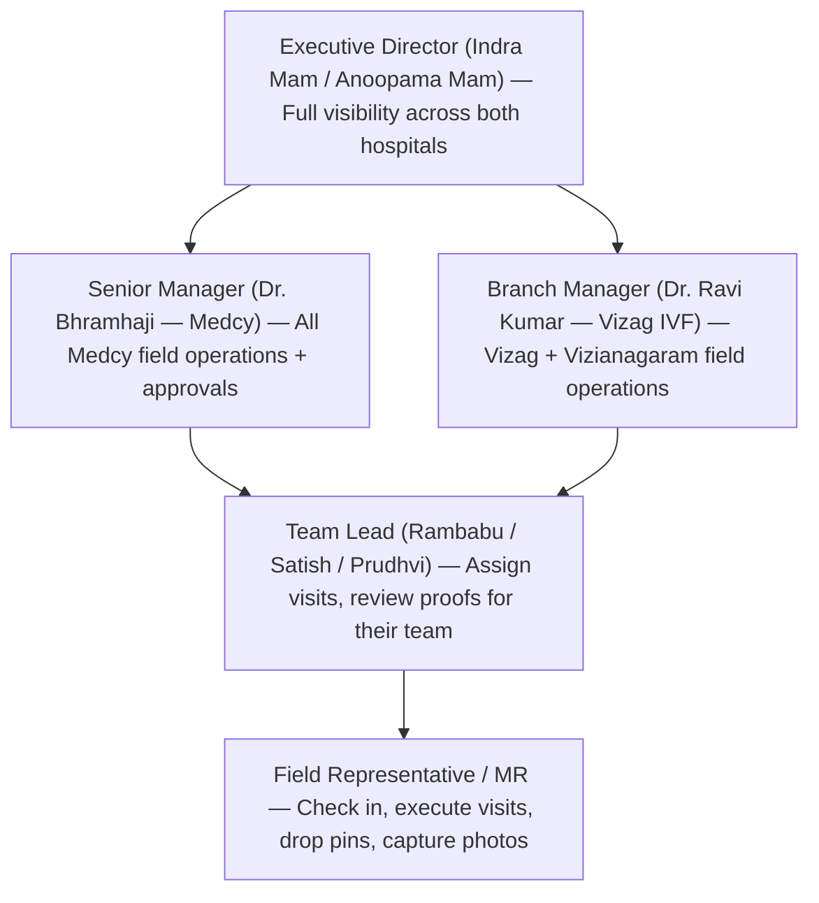
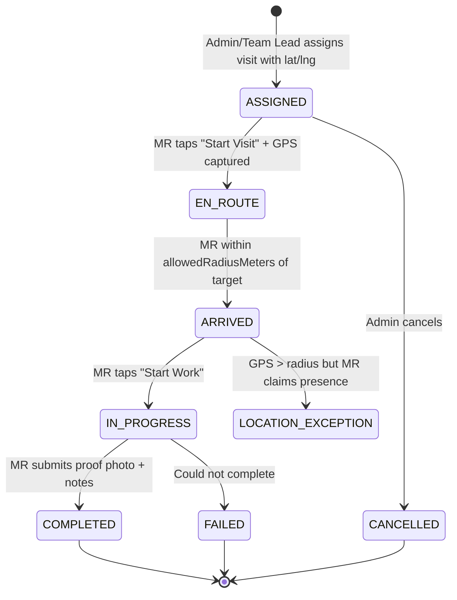
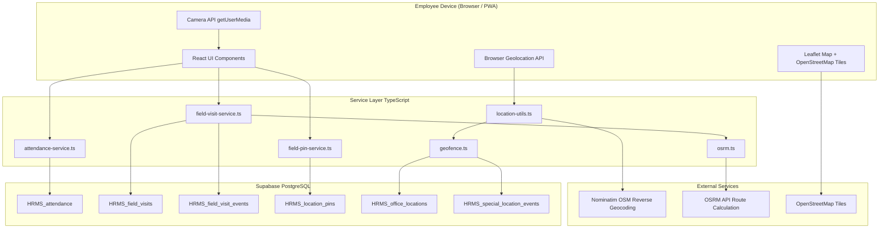

# Geo-Tagging Business Overview
### VizagIVF HRMS — Medcy Health Tech

> **Role:** Expert Senior Architect (20+ YoE, MANGOS Domain)
> **Document Version:** 1.0
> **Date:** September 2026
> **Scope:** Geo-Tagging sub-system — Business Purpose, Architecture, Data Contracts, Operational Flows, and Governance

---

## Table of Contents

1. [Executive Summary](#1-executive-summary)
2. [Business Problem Statement](#2-business-problem-statement)
3. [Strategic Objectives](#3-strategic-objectives)
4. [Who Uses This? (User Personas)](#4-who-uses-this-user-personas)
5. [Core Geo-Tagging Capabilities](#5-core-geo-tagging-capabilities)
6. [System Architecture](#6-system-architecture)
7. [Operational Workflows](#7-operational-workflows)
8. [Data Schema Reference](#8-data-schema-reference)
9. [Technology Stack](#9-technology-stack)
10. [Geofence Logic & Algorithms](#10-geofence-logic--algorithms)
11. [Map Configuration & Tile Strategy](#11-map-configuration--tile-strategy)
12. [Business Rules & Constraints](#12-business-rules--constraints)
13. [Security & Compliance Considerations](#13-security--compliance-considerations)
14. [Scalability & Operational Notes](#14-scalability--operational-notes)
15. [Future Roadmap](#15-future-roadmap)

---

## 1. Executive Summary

The Geo-Tagging sub-system within the VizagIVF HRMS is the **real-time spatial intelligence backbone** for managing the dispersed field-force operations of two sister healthcare organizations — **Vizag IVF** and **Medcy Hospitals** — operating across Visakhapatnam and Vizianagaram.

At its core, Geo-Tagging solves a fundamental challenge of distributed healthcare operations: **how do you prove that a field employee was at the right place, at the right time, doing the right thing?**

The system provides a layered answer through:
- **Attendance Geofencing** — verifiable office check-ins using GPS radius enforcement
- **Field Visit Tracking** — structured, mission-bound location capture for patient, clinic, pharmacy, and corporate visits
- **Photo-Location Evidence** — timestamped photographic proof tied to GPS coordinates
- **Location Pin Timeline** — lightweight, on-demand geo-markers dropped by field staff at key moments
- **OSRM Route Planning** — calculated driving route distance and ETA from field positions to assigned destinations
- **Reverse Geocoding** — human-readable address labels on every GPS coordinate captured

---

## 2. Business Problem Statement

Field medical representatives (MRs) and healthcare executives operate outside the four walls of any office. Without spatial accountability:

| Pain Point | Business Impact |
|---|---|
| No way to verify if MR visited assigned doctors/clinics | Commission disputes, phantom visits, compliance risk |
| Check-in manipulation without GPS (fake time punches) | Payroll fraud, inaccurate attendance records |
| No route visibility during urgent sample collection runs | Late deliveries, patient dissatisfaction |
| Manual check-in reporting with no photo evidence | Audit failures, insurance claim rejections |
| Multi-city operations (Vizag + Vizianagaram) with no central visibility | Manager blindspot for remote employees |
| Team leads unaware of their team's real-time field status | Poor task routing, no SLA enforcement |

---

## 3. Strategic Objectives

```
1. ACCOUNTABILITY  — Every field action carries a verifiable GPS coordinate and timestamp.
2. TRANSPARENCY    — Managers and team leads can see exactly where their team has been.
3. COMPLIANCE      — All geo-tags are stored in the database for auditing and payroll disputes.
4. SAFETY          — Anomalous locations (location exceptions) are flagged automatically.
5. EFFICIENCY      — Optimized routes via OSRM reduce unnecessary field travel time.
6. FLEXIBILITY     — Special event locations (medical camps, client sites) can extend
                     the authorized geofence without system changes.
```

---

## 4. Who Uses This? (User Personas)



| Persona | Geo-Tagging Capabilities |
|---|---|
| **Executive Director** | Live map of all employees across both hospitals; audit trail exports |
| **Senior Manager (Medcy)** | View all Medcy MR locations; field visit status dashboard; leave geo-flags |
| **Branch Manager (Vizag IVF)** | Assign geo-tagged field visits; see check-in heatmap by date |
| **Team Lead** | Bulk-assign visits to team; review photo proofs with GPS stamps |
| **Field Rep (MR)** | Check in/out (with geo-verification); execute assigned visits; drop custom pins |

---

## 5. Core Geo-Tagging Capabilities

### 5.1 Attendance Geofencing (Office Check-In)

Each attendance record is geo-validated on check-in:

```
Employee taps "Start Shift"
       |
Browser Geolocation API fires (high accuracy, 10s timeout)
       |
Haversine distance calculated against all active office locations
       |
  +-----------------------------------------+
  |   Within radius of any active office?   |
  +-----------------------------------------+
       | YES                       | NO
   Punch Type: "in_office"    Punch Type: "out_of_office"
   (standard)                 (location logged, manager alerted)
       |
   check_in_lat_lng saved (e.g. "17.6868,83.2185")
   check_in_location saved (reverse geocoded address)
   check_in_photo_url saved (selfie capture)
```

**Key fields stored per attendance record:**

| Field | Description |
|---|---|
| `check_in_lat_lng` | Raw GPS coordinates as `"lat,lng"` string |
| `check_in_location` | Human-readable reverse geocoded address |
| `check_in_photo_url` | Selfie captured at check-in moment |
| `punch_type` | `in_office` or `out_of_office` |
| `punch_note` | Optional field-note (e.g., medical camp name) |
| `session_number` | Supports multiple shift sessions per day |

---

### 5.2 Field Visit Tracking (Mission-Based GPS)

The most sophisticated geo-tagging layer. A **Field Visit** is a structured mission with:
- A pre-assigned GPS target (clinic, patient home, pharmacy, corporate office)
- A configurable **geofence radius** (default: 150 meters)
- Status lifecycle with geo-validated state transitions



**Visit types supported:**

| Code | Business Use Case |
|---|---|
| `PATIENT_VISIT` | Home visit for IVF patient follow-up |
| `SAMPLE_COLLECTION` | Biological sample pickup from patient home |
| `DIAGNOSTIC_VISIT` | Diagnostic lab or imaging center coordination |
| `PHARMACY_VISIT` | Pharmacy liaison / stock check |
| `MEDICAL_CAMP` | External medical camp assignment |
| `CLIENT_VISIT` | Corporate client / insurance company visit |
| `DELIVERY` | Medical supply / document delivery |
| `CORPORATE_VISIT` | Partnership/corporate engagement |
| `INSURANCE_VISIT` | Health insurance empanelment or claim visit |

---

### 5.3 Photo Evidence System (Geo-Stamped Proof)

Every critical field action captures a **timestamped photo + GPS coordinate** as audit-grade proof:

| Event | Photo Captured | GPS Captured |
|---|---|---|
| Shift Start (Check-in) | Selfie | `check_in_lat_lng` |
| Shift End (Check-out) | Selfie | `check_out_lat_lng` |
| Visit Start (EN_ROUTE) | Selfie + environment | `actual_lat/lng` |
| Visit Completion Proof | Doctor/clinic photo | `proof_lat/lng` in proofs table |
| Custom Pin Drop | Location photo (optional) | Pin lat/lng |

The **CallPhotoCaptureView** component manages the in-browser camera stream, allowing:
- Front/back camera toggle for selfie vs. environment capture
- GPS acquisition concurrent with camera stream activation
- Fallback to GPS-less submission if camera is unavailable

---

### 5.4 Location Pin Timeline (Lightweight Geo-Markers)

Beyond structured field visits, MRs can drop **ad-hoc location pins** during any part of their shift — creating an auditable timeline of their physical journey:

| Pin Category | Business Meaning |
|---|---|
| `Patient Home` | A patient residence visited |
| `Clinic Entrance` | Arrived at a clinical facility |
| `Sample Collected` | Biological sample successfully collected at this spot |
| `Lab Drop-off` | Sample deposited at laboratory |
| `Delivery Point` | Delivery made / received |
| `Exception Site` | Anomalous location requiring manager review |
| `Other` | Custom label by MR |

Pins are stored in `HRMS_location_pins` and displayed in the UI as a chronological timeline per shift day.

---

### 5.5 OSRM Route Planning (Field Navigation)

When a field visit has an assigned destination (lat/lng), the system automatically computes a **driving route** from the MR's current/actual position to the target using the **OSRM (Open Source Routing Machine)** API:

```
Actual position (or default center)
        |
OSRM REST API -> /route/v1/driving/{lng1},{lat1};{lng2},{lat2}
        |
Returns: distance (km), duration (minutes), polyline geometry
        |
Rendered on Leaflet map as blue route line
```

This enables:
- Managers to see expected travel time for each MR
- MRs to understand how far their assigned visit is
- SLA breach detection (visit overdue relative to scheduled time)

---

### 5.6 Special Event Geofences (Medical Camps, Client Sites)

Beyond permanent office locations, **Special Location Events** allow administrators to create **temporary authorized geofences**:

```
Admin creates: Medical Camp — Gajuwaka
  - lat/lng: 17.6520, 83.2100
  - radius_meters: 100
  - from_date: 2026-09-10
  - to_date: 2026-09-15
  - assignees: [MR-001, MR-002, MR-003]
```

When an assigned MR checks in between these dates from within the camp radius, the punch registers as `in_office` (authorized). This removes the need for any code changes when deploying field teams to off-site events.

---

## 6. System Architecture



---

## 7. Operational Workflows

### 7.1 Office-Based Employee Daily Workflow

```
8:30 AM  Employee opens HRMS PWA on phone
            |
         Taps "Start Shift"
            |
         GPS acquired (browser geolocation, 10s timeout)
            |
         Haversine check: Is employee within 50m of any active office?
            | YES                    | NO
         Camera opens             Punch saved as "out_of_office"
         Selfie captured          Manager sees flag on attendance dashboard
            |
         Record saved: HRMS_attendance
         (check_in_time, check_in_lat_lng, check_in_location,
          check_in_photo_url, punch_type='in_office', session_number=1)
            |
6:30 PM  Employee taps "End Shift"
            |
         GPS + selfie captured again
            |
         Record updated: check_out_time, check_out_lat_lng, check_out_location
```

---

### 7.2 Field Representative Daily Workflow

```
Morning  Admin/Team Lead assigns visits via AssignVisitModal
         Sets: lat/lng, radius, visit type, scheduled time, priority

8:00 AM  MR opens "Field Duty" tab
            |
         Taps "Start Field Duty"
            |
         Field Session created (HRMS_field_sessions)
         GPS: session start lat/lng captured

9:00 AM  MR views assigned visits -> selects first visit
            |
         OSRM route computed: MR position -> Visit destination
         (displays distance in km, ETA in minutes)
            |
         MR taps "En Route"
            |
         Status -> EN_ROUTE, GPS logged to HRMS_field_visit_events

9:45 AM  MR arrives at clinic/patient location
            |
         MR taps "Mark Arrived"
            |
         GPS captured -> Haversine distance vs. assignedLat/Lng
         If dist <= allowedRadiusMeters (150m):  ARRIVED [OK]
         If dist > radius:  LOCATION_EXCEPTION [Manager flagged]
            |
         MR performs work

10:15 AM MR taps "Complete Visit"
            |
         Photo captured (doctor/clinic proof)
         GPS captured (actual completion location)
         Notes entered
            |
         HRMS_field_visit_proofs record created (photo, GPS, timestamp)
         HRMS_field_visits: status=COMPLETED, completedAt, durationMinutes
            |
         Next visit in queue shown

6:00 PM  MR taps "End Duty"
            |
         Field Session closed (HRMS_field_sessions: ended_at, end_lat/lng)
```

---

### 7.3 Manager / Admin Monitoring Workflow

```
Admin opens "Field Operations" tab
       |
Live map rendered (Leaflet + OpenStreetMap)
Markers:
  BLUE  = Active MR check-in location
  GREEN = Completed visit proof location
  AMBER = En-route MR
  RED   = Location exception flag
       |
Admin clicks any MR marker -> EmployeeLocationModal opens
  - Name, photo, check-in time
  - GPS coordinates
  - Distance from office
  - Today's visit completion rate
       |
Admin reviews Visit List tab
  - All visits by date (filter: today, all, specific date)
  - Status breakdown: ASSIGNED / EN_ROUTE / ARRIVED / COMPLETED / MISSED
  - Proof photo preview with GPS stamp
```

---

## 8. Data Schema Reference

### Core Geo-Tagged Tables

```sql
-- 1. Attendance with GPS
HRMS_attendance (
  id UUID PK,
  employee_id           VARCHAR NOT NULL,
  date                  DATE NOT NULL,
  status                VARCHAR,
  check_in_time         TIME,
  check_in_location     TEXT,           -- Reverse geocoded address
  check_in_lat_lng      TEXT,           -- "17.6868,83.2185"
  check_in_photo_url    TEXT,           -- Supabase Storage URL
  check_out_time        TIME,
  check_out_location    TEXT,
  check_out_lat_lng     TEXT,
  check_out_photo_url   TEXT,
  punch_type            VARCHAR,        -- 'in_office' | 'out_of_office'
  punch_note            TEXT,
  session_number        INTEGER         -- Multiple sessions per day supported
);

-- 2. Field Visits (Mission GPS Records)
HRMS_field_visits (
  id UUID PK,
  employee_id           VARCHAR NOT NULL,
  session_id            UUID,
  visit_type            VARCHAR,        -- PATIENT_VISIT, SAMPLE_COLLECTION, etc.
  scheduled_date        DATE,
  assigned_latitude     NUMERIC(10,7),  -- Pre-assigned target location
  assigned_longitude    NUMERIC(10,7),
  assigned_address      TEXT,
  allowed_radius_meters INTEGER,        -- Geofence tolerance (default: 150m)
  status                VARCHAR,        -- ASSIGNED -> ... -> COMPLETED
  actual_latitude       NUMERIC(10,7),  -- GPS captured on arrival
  actual_longitude      NUMERIC(10,7),
  actual_address        TEXT,           -- Reverse geocoded arrival address
  arrival_distance_m    INTEGER,        -- Distance from assigned target on arrival
  proof_photo_url       TEXT,           -- Completion evidence photo
  location_exception    BOOLEAN         -- TRUE if GPS > allowed radius
);

-- 3. Field Event Audit Log (append-only)
HRMS_field_visit_events (
  id UUID PK,
  visit_id      UUID,
  employee_id   VARCHAR NOT NULL,
  event_type    VARCHAR,           -- VISIT_EN_ROUTE, VISIT_ARRIVED, etc.
  occurred_at   TIMESTAMPTZ,
  latitude      NUMERIC(10,7),
  longitude     NUMERIC(10,7),
  accuracy_m    NUMERIC(8,2),     -- GPS accuracy in metres
  address       TEXT,
  metadata      JSONB              -- Extensible payload per event type
);

-- 4. Employee Location Pin Timeline
HRMS_location_pins (
  id UUID PK,
  employee_id   VARCHAR NOT NULL,
  date          DATE,
  pinned_at     TIME,
  label         TEXT,
  latitude      NUMERIC(10,7),
  longitude     NUMERIC(10,7),
  location_name TEXT,             -- Reverse geocoded
  photo_url     TEXT,
  pin_type      VARCHAR           -- 'field_visit' | 'medical_camp' | etc.
);

-- 5. Office Geofence Definitions
HRMS_office_locations (
  id UUID PK,
  name          VARCHAR NOT NULL,
  latitude      NUMERIC(10,7) NOT NULL,
  longitude     NUMERIC(10,7) NOT NULL,
  radius_meters INTEGER,          -- Check-in authorized radius
  is_active     BOOLEAN
);

-- 6. Temporary Geofences (Medical Camps, Events)
HRMS_special_location_events (
  id UUID PK,
  name          VARCHAR,
  event_type    VARCHAR,          -- 'medical_camp' | 'client_site' | 'training'
  latitude      NUMERIC(10,7),
  longitude     NUMERIC(10,7),
  radius_meters INTEGER,
  from_date     DATE,
  to_date       DATE
);
```

---

## 9. Technology Stack

| Layer | Technology | Rationale |
|---|---|---|
| **Browser GPS** | `navigator.geolocation.getCurrentPosition()` | Native API, no SDK dependency, works on all modern browsers |
| **Geofence Math** | Haversine Formula (custom `geofence.ts`) | Accurate great-circle distance for GPS coordinates up to ~100km |
| **Reverse Geocoding** | Nominatim (OpenStreetMap) | Free, no API key, India-accurate, GDPR-friendly |
| **Map Rendering** | React-Leaflet + OpenStreetMap tiles | Open-source, offline-capable tile caching, no vendor lock-in |
| **Route Planning** | OSRM Public Demo API | Open-source routing, turn-by-turn distance and duration |
| **Database** | Supabase PostgreSQL | `NUMERIC(10,7)` precision for GPS coordinates (~1.1 cm accuracy) |
| **File Storage** | Supabase Storage (proof photos) | CDN-backed, RLS-controlled, URL-referenced from DB |
| **PWA** | Vite PWA Plugin (Workbox) | Offline-first field use; service worker caches static assets |
| **Camera** | `navigator.mediaDevices.getUserMedia()` | Front/rear camera toggle, fallback handling for device diversity |

---

## 10. Geofence Logic & Algorithms

### Haversine Distance Calculation

```typescript
// src/lib/geofence.ts
export function getDistanceMeters(lat1, lon1, lat2, lon2): number {
  const R = 6371000; // Earth radius in metres
  const phi1 = (lat1 * Math.PI) / 180;
  const phi2 = (lat2 * Math.PI) / 180;
  const dPhi = ((lat2 - lat1) * Math.PI) / 180;
  const dLambda = ((lon2 - lon1) * Math.PI) / 180;
  const a = Math.sin(dPhi/2)**2 + Math.cos(phi1) * Math.cos(phi2) * Math.sin(dLambda/2)**2;
  return R * 2 * Math.atan2(Math.sqrt(a), Math.sqrt(1-a));
}
```

**Accuracy:** At coordinate precision of `NUMERIC(10,7)` (~1.1 cm), this formula is accurate to within **±5 metres** for distances relevant to office/field check-in (5m–5km range).

### Geofence Check Decision Tree

```
resolveAllowedLocations(employeeId, today)
  |- Fetch: HRMS_office_locations WHERE is_active = TRUE
  +- Fetch: HRMS_special_event_assignees JOIN HRMS_special_location_events
            WHERE today BETWEEN from_date AND to_date
            AND employee_id = :employeeId

checkGeofence(userLat, userLng, allowedLocations[])
  FOR each location:
    dist = getDistanceMeters(userLat, userLng, loc.lat, loc.lng)
    IF dist <= loc.radius_meters  ->  ALLOWED [punch_type: 'in_office']

  IF none matched -> REJECTED [punch_type: 'out_of_office']
  Returns: { allowed, matchedLocation, distance, nearestOfficeName }
```

### GPS Acquisition Strategy (Resilient Two-Attempt Pattern)

```typescript
// src/shared/utils/location-utils.ts
async function getCurrentLocationSafe() {
  try {
    // Attempt 1: Low accuracy, fast (5s timeout) — saves battery
    position = await getPosition(enableHighAccuracy=false, timeout=5000);
  } catch {
    // Attempt 2: High accuracy, slower (10s timeout) — for field open areas
    position = await getPosition(enableHighAccuracy=true, timeout=10000);
  }
  // Always attempt reverse geocoding for human-readable address
  address = await getReverseGeocode(latitude, longitude);
}
```

This dual-attempt strategy balances **battery conservation** (low accuracy first) with **field reliability** (high accuracy fallback for outdoor environments with weaker signals).

---

## 11. Map Configuration & Tile Strategy

All map configuration is centralized in `fieldOpsConfig.ts` and driven by environment variables:

| Config Key | Default Value | Purpose |
|---|---|---|
| `VITE_MAP_DEFAULT_LAT` | `17.6868` | Default map center (Visakhapatnam) |
| `VITE_MAP_DEFAULT_LNG` | `83.2185` | Default map center |
| `VITE_MAP_DEFAULT_ZOOM` | `13` | Street-level zoom on load |
| `VITE_MAP_TILE_URL` | OSM standard tiles | Map layer provider |
| `VITE_OSRM_ENDPOINT` | `https://router.project-osrm.org` | Route computation |
| `VITE_NOMINATIM_COUNTRY_CODES` | `in` | India-scoped address search |
| `VITE_LIVE_BROADCAST_INTERVAL_MS` | `10000` | Telemetry broadcast interval |

> **Production Note:** The OSRM public demo server (`router.project-osrm.org`) is for **proof-of-concept use only**. Before scaling to production, a **self-hosted OSRM instance** must be deployed using the OSM India PBF extract.

---

## 12. Business Rules & Constraints

| Rule | Implementation |
|---|---|
| **Out-of-Office attendance is allowed** | Punch type `out_of_office` is logged (not blocked); manager sees the flag |
| **Visit arrival validated by radius** | `arrival_distance_m` logged; `location_exception=TRUE` if outside radius |
| **Multiple check-in sessions per day** | `session_number` column; each new check-in gets `MAX(session_number) + 1` |
| **Proof photo required for completion** | UI enforces camera capture before COMPLETED status transition |
| **Special events override office geofence** | `resolveAllowedLocations()` merges office + active camp locations |
| **GPS precision stored at 7 decimal places** | `NUMERIC(10,7)` = ~1.1 cm accuracy |
| **Reverse geocoding is non-blocking** | Network timeout 3s; graceful fallback to `"Location details unavailable"` |
| **90-day GPS position retention** | Cleanup script in `04_field_positions_pins_schema.sql` (pending pg_cron setup) |
| **No live broadcast in current build** | Continuous telemetry is architected but disabled to reduce data costs |

---

## 13. Security & Compliance Considerations

### Data Privacy
- All GPS data is stored **per employee** with `employee_id` foreign key enforcement
- Supabase Row Level Security (RLS) should be configured so:
  - Employees can only read their own location records
  - Team Leads can read their direct team's location records
  - Managers / Executives have broader read access based on hierarchy
- Photos stored in Supabase Storage with **private bucket + signed URLs** (not public)

### Audit Trail
- `HRMS_field_visit_events` is an **append-only table** — every GPS state transition is immutable
- Attendance records store both `check_in_lat_lng` and `check_out_lat_lng` independently
- `pinned_at` timestamps prevent backdated pin drops

### Data Minimization
- GPS captured only at **specific business events** (check-in, visit status changes, pin drops)
- No continuous background tracking in the current implementation
- OSRM routing uses the MR's current position as a one-time query — not stored on the routing server

---

## 14. Scalability & Operational Notes

### Current Deployment
- **Hospitals:** Vizag IVF + Medcy Hospitals
- **Branches:** Visakhapatnam + Vizianagaram
- **Field Staff:** ~13 active employees (growing)

### Scaling Considerations

| Concern | Current State | Recommended Action |
|---|---|---|
| OSRM routing | Public demo server | Self-host on VPS with India OSM PBF |
| Nominatim geocoding | Public server (rate-limited) | Cache results in DB; or use Google Maps API for production load |
| Map tiles | Public OSM CDN | Mirror tiles via a tile proxy/CDN for reliability |
| Field visit positions table | Unlimited growth | Activate 90-day automated cleanup via pg_cron |
| Photo storage | Supabase Storage free tier | Monitor storage quota; archive photos older than 90 days to cold storage |
| Multi-city GPS accuracy | Works within 5m | No change needed for city-scale operations |

---

## 15. Future Roadmap

| Feature | Priority | Description |
|---|---|---|
| **Doctor Visit Planner** | In Progress | MRs log their doctor-visit schedules weekly; team leads review coverage |
| **Live Position Broadcast** | Planned | Opt-in real-time location sharing during active field sessions |
| **Route Deviation Alerts** | Planned | Alert if MR deviates >2km from planned OSRM route |
| **Geofence Heat Maps** | Planned | Weekly aggregate map of where visits are concentrated by area |
| **Offline GPS Queuing** | Future | Queue GPS events locally when offline; sync on reconnect |
| **Automated SLA Breach Alerts** | Future | Push notification when visit exceeds scheduled time window |
| **Doctor Geo-Tagging** | Future | Map of doctors visited per MR per week for territory analysis |
| **Territory Management** | Future | Draw territory polygons, assign MRs to territories |

---

## Appendix A: Key Source Files

| File | Purpose |
|---|---|
| `src/lib/geofence.ts` | Haversine distance, geofence check, location resolver |
| `src/shared/utils/location-utils.ts` | GPS acquisition, reverse geocoding |
| `src/lib/services/attendance-service.ts` | Clock-in/out with GPS; live check-in locations |
| `src/lib/services/field-visit-service.ts` | Visit CRUD, arrival validation, proof submission |
| `src/lib/osrm.ts` | OSRM route fetch and distance calculation |
| `src/lib/fieldOpsConfig.ts` | Centralized map and field ops configuration |
| `src/components/CheckInModule.tsx` | Employee-facing check-in/out UI with camera + GPS |
| `src/components/FieldDutyModule.tsx` | MR field session, visit list, route display |
| `src/components/FieldOpsModule.tsx` | Admin field operations dashboard and live map |
| `src/components/fieldops/CallPhotoCaptureView.tsx` | Camera + GPS capture during field visit actions |
| `src/components/fieldops/DropPinModal.tsx` | Custom location pin drop with category selection |
| `src/components/AdminOfficeLocations.tsx` | Admin management of office geofence zones |
| `database/03_field_force_schema.sql` | Field sessions, visits, events, proofs schema |
| `database/04_field_positions_pins_schema.sql` | GPS position trail and custom pins schema |
| `database/04_location_roster_schema.sql` | Office geofence locations, special events, location pins |

---

*Document authored by: Senior Architect, MANGOS Domain*
*Repository: VizagIVF_HRMS*
*Last Updated: September 2026*
